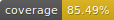

# GitHub docker container deno action




[](https://sonarcloud.io/summary/new_code?id=roamingowl_github-action-docker-deno-template)

## Description

This is a template for
[docker container](https://docs.github.com/en/actions/creating-actions/about-custom-actions)
deno action.

## Usage

[Create your own action repository](https://docs.github.com/en/repositories/creating-and-managing-repositories/creating-a-repository-from-a-template#creating-a-repository-from-a-template)
from this template and update it to your needs.

## Initial setup

Remove or update [CODEOWNERS](./CODEOWNERS) file.

## Linting and formatting

To lint the code run

```bash
deno lint
```

To auto-format all `.ts`, `.js`, `.md` and `.json` files run:

```angular2html
deno fmt
```

## Running tests

```bash
deno test
```

## Releasing

It is recommended to follow
[standard GitHub action versioning](https://github.com/actions/toolkit/blob/main/docs/action-versioning.md).
Examples:

- use tags like `v1`, `v1.0.0` etc.

In case you used new import or library, update lock file by running:

```bash
deno task lock
```

There is no need for running extra build step here like it is with
[javascript action](https://docs.github.com/en/actions/creating-actions/creating-a-javascript-action).
Optionally, if you decide to use coverage badge, run

```bash
deno task coverage:badge
```

to generate it.

Then create/update appropriate tags:

```bash
#new version tag
git tag v2.0.0
# update v2 tag
git push --delete origin v2
git tag -f v1
git push origin --tags
```

Now using newly created tag `v2.0.0`
[create a new release in GitHub](https://docs.github.com/en/repositories/releasing-projects-on-github/managing-releases-in-a-repository#creating-a-release)

## Docker image

This action is using basic
[deno debian image](https://hub.docker.com/r/denoland/deno) - because it is the
default one for deno. But feel free to switch to alpine if you need to shrink
the size a bit.

> Note: When using [google/zx](https://github.com/google/zx) library, use debian
> instead of alpine to prevent issues.
